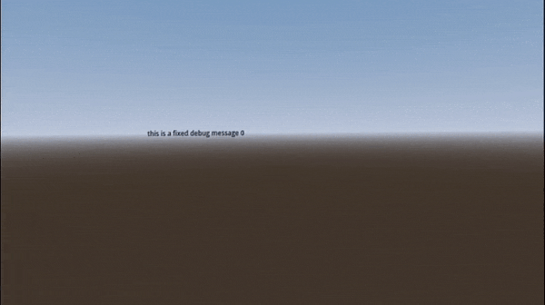

# XR Debug konsole Plugin

A Godot plugin to print Label3D messages in front of the XRCamera

If you like 'tracing debugging', 'print debugging' or whatever name you prefer to do debugging with print statements inserted in your code, this will help you not to be taking off your XR headset to check the console.

## USAGE

* First define your current camera with

	DK.set_current_camera(path_to_xr_camera)
	
* Then you can use the following commands

	DK.print_fixed(msg)

	DK.print_float(msg, delay)

	DK.clean_all_in_fixed_konsole()

> **Warning**
If you are using some kind of staging system, be careful to set current camera again if you change your current one.

## Fixed konsole variables:

Use this offsets to define the position of the fixed konsole based on the camera position

	DK.fixed_konsole_z_offset
	DK.fixed_konsole_x_offset
	DK.fixed_konsole_y_offset

Use this properties to setup fixed label styles

	DK.fixed_font_size : int
	DK.fixed_outline_size : int
	DK.fixed_modulate : Color
	DK.fixed_outline_modulate : Color

Use autoclean to define max number of fixed lines

	autoclean : int

## Floating konsole variables:
	
Use this offsets to define the position of the fixed konsole based on the fixed konsole
	
	DK.float_konsole_z_offset : float
	DK.float_konsole_x_offset : float
	DK.float_konsole_y_offset : float

Use this properties to setup floating label styles

	DK.float_font_size : int
	DK.float_outline_size : int
	DK.float_modulate : Color
	DK.float_outline_modulate : Color

Use this to change default duration for floating labels 

	DK.float_default_duration : int

Use this to change floating labels velocity

	DK.float_labels_velocity : float
