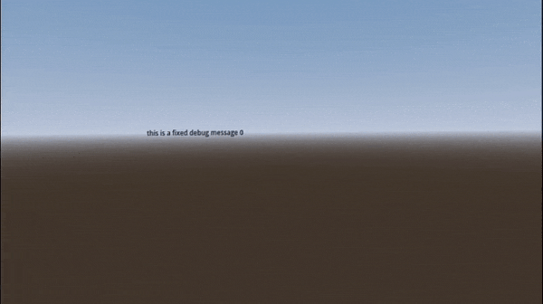

# XR Debug konsole Plugin

A Godot plugin to print Label3D messages in front of the XRCamera

## USAGE

	DK.print_fixed(msg, camera)

	DK.print_float(msg, camera, delay)

	DK.clean_all_in_fixed_konsole()

## Fixed konsole variables:

Use this offsets to define the position of the fixed konsole based on the camera position

	DK.fixed_konsole_z_offset
	DK.fixed_konsole_x_offset
	DK.fixed_konsole_y_offset

Use this properties to setup fixed label styles

	DK.fixed_font_size : int
	DK.fixed_outline_size : int
	DK.fixed_modulate : Color
	DK.fixed_outline_modulate : Color

Use autoclean to define max number of fixed lines

	autoclean : int

## Floating konsole variables:
	
Use this offsets to define the position of the fixed konsole based on the fixed konsole
	
	DK.float_konsole_z_offset : float
	DK.float_konsole_x_offset : float
	DK.float_konsole_y_offset : float

Use this properties to setup floating label styles

	DK.float_font_size : int
	DK.float_outline_size : int
	DK.float_modulate : Color
	DK.float_outline_modulate : Color

Use this to change default duration for floating labels 

	DK.float_default_duration : int

Use this to change floating labels velocity

	DK.float_labels_velocity : float
